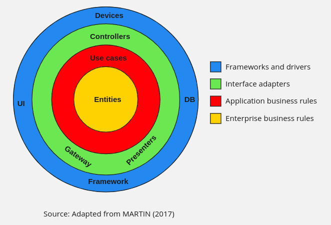

# Introduction

Nas últimas décadas, vimos uma gama completa de ideias a respeito da arquitetura de sistemas. Estas incluem:
• Arquitetura Hexagonal (também conhecida como Portas e Adaptadores), desenvolvida por Alistair
Cockburn e adotada por Steve Freeman e Nat Pryce em seu excelente livro Growing Object Oriented Software with Tests
• DCI, de James Coplien e Trygve Reenskaug
• BCE, introduzida por Ivar Jacobson em seu livro Object Oriented Software Engineering: A Use-Case Driven Approach
Embora essas arquiteturas variem um pouco em seus detalhes, elas são muito semelhantes.

Todas têm o mesmo objetivo, que é a separação de responsabilidades.

Essa separação dividindo o software em camadas. Cada um tem pelo menos um camada para regras de negócios e outra camada para interfaces de usuário e sistema.

Cada uma dessas arquiteturas produz sistemas que possuem as seguintes características:
• Independente de estruturas. A arquitetura não depende da existência de alguma biblioteca de software repleto de recursos. Isso permite que você use estruturas como ferramentas, em vez de forçá-lo a sobrecarregar seu sistema com suas restrições limitadas.

• Testável. As regras de negócios podem ser testadas sem UI, banco de dados, servidor web ou qualquer outro elemento externo.

• Independente da IU. A UI pode mudar facilmente, sem alterar o resto do sistema. Uma IU da web pode ser substituída por uma IU de console, por exemplo, sem alterando as regras de negócios.


• Independente do banco de dados. Você pode trocar Oracle ou SQL Server por Mongo, BigTable, CouchDB ou qualquer outra coisa. Suas regras de negócios não estão vinculadas ao banco de dados.


• Independente de qualquer agência externa. Na verdade, suas regras de negócios não sabem absolutamente nada sobre as interfaces com o mundo exterior.


# Clean Architecture

A Clean Architecture, conceito popularizado por Robert C. Martin (também conhecido como Uncle Bob), é uma metodologia de design de software que visa minimizar as dependências de alto nível e manter o código organizado, testável e flexível. A arquitetura é dividida em camadas com responsabilidades bem definidas, o que permite uma maior manutenção e a possibilidade de substituir componentes sem afetar outras partes do sistema.

## Componentes da Clean Architecture

A Clean Architecture é composta pelas seguintes camadas:

1. **Entities**: São os objetos de domínio que encapsulam a lógica de negócios mais crítica da aplicação.
2. **Use Cases**: Contêm a lógica de negócios específica da aplicação e orquestram o fluxo de dados para e das entidades, direcionando esses dados para a camada de Interface de Usuário ou a camada de Infraestrutura.
3. **Interface Adapters**: Esta camada converte dados entre as formas mais convenientes para os use cases e entidades, e as formas mais convenientes para algum agente externo como o Banco de Dados ou a Web.
4. **Frameworks and Drivers**: Esta é a camada mais externa e geralmente consiste em frameworks e ferramentas como o Banco de Dados, o Web Framework, etc.




## Exemplo de Distribuição de Pacotes

Considere um projeto Java que implementa Clean Architecture. Aqui está uma possível estrutura de pacotes para esse projeto:

### Estrutura de Diretórios

```
src/
└── main/
    ├── java/
    │   └── com/
    │       └── minhaempresa/
    │           └── minhaaplicacao/
    │               ├── core/
    │               │   ├── domain/
    │               │   │   ├── User.java
    │               │   │   └── UserRepository.java
    │               │   ├── usecases/
    │               │   │   ├── UserUseCase.java
    │               │   │   └── UserInteractor.java
    │               │   └── ports/
    │               │       ├── UserService.java
    │               │       └── UserDataAccess.java
    │               ├── adapters/
    │               │   ├── controller/
    │               │   │   ├── UserController.java
    │               │   │   └── UserViewModel.java
    │               │   ├── repository/
    │               │   │   ├── UserRepositoryImpl.java
    │               │   │   └── DatabaseConnection.java
    │               └── config/
    │                   └── ApplicationConfig.java
    ├── resources/
    │   └── application.properties
    └── webapp/
        └── WEB-INF/
            └── web.xml
```

### Descrição dos Componentes

#### Core (Regras de Negócios)
- **`domain` (Entities)**: Contém as classes de entidades como `User`, que representam os objetos de negócio.
- **`usecases`**: Módulos como `UserUseCase` e `UserInteractor` que contêm a lógica de negócios e interagem diretamente com os objetos do domínio.
- **`ports`**: Interfaces como `UserService` (porta de entrada para os use cases) e `UserDataAccess` (porta de saída para a infraestrutura).

#### Adapters (Interface Adapters)
- **`controller`**: Adaptadores para a camada de interface de usuário, como `UserController`, que manipula dados entre a representação do usuário na web e o formato necessário para os use cases.
- **`repository`**: Implementações de `UserDataAccess`, como `UserRepositoryImpl`, que interagem com o banco de dados.

#### Frameworks and Drivers
- **`config`**: Configurações da aplicação e específicações do framework, como a inicialização do Spring ou outra infraestrutura de suporte.
- **`resources/application.properties`**: Propriedades externas e configurações do banco de dados.

## Benefícios da Clean Architecture

1. **Independência de Frameworks**: O sistema não depende da existência de uma biblioteca de software específica.
2. **Testabilidade**: A lógica de negócios pode ser testada sem a UI, o banco de dados, o servidor web ou qualquer outro elemento externo.
3. **Independência da UI**: A UI pode mudar facilmente, sem mudar o restante do sistema.
4. **Independência do Banco de Dados

**: É possível mudar o Oracle para SQL Server, por exemplo, sem mudar a lógica de negócios.
5. **Manutenibilidade**: A manutenção é mais fácil devido à separação clara das responsabilidades e desacoplamento das dependências.

Ao adotar a Clean Architecture, você facilita a escalabilidade, manutenibilidade e a flexibilidade do seu software, o que é crucial para aplicações empresariais complexas e de longo prazo.


# 🏛️ Clean Architecture: Fundamentos e Prática

### 4.01 - Apresentação e Motivação: Por que Clean Architecture?
O objetivo primário de qualquer arquitetura de software é **minimizar o esforço humano necessário para construir e manter o sistema**. 

Sistemas sem arquitetura intencional rapidamente se tornam uma "grande bola de lama", onde o custo de adicionar novas *features* cresce exponencialmente ao longo do tempo. A Clean Architecture motiva a separação de interesses (*Separation of Concerns*) para que o "coração" do software (as regras de negócio) seja independente de frameworks, banco de dados, interfaces de usuário e agências externas. O objetivo é adiar decisões de infraestrutura e manter o sistema flexível.

### 4.02 - Princípios Fundamentais e a Regra de Dependência
O pilar central da Clean Architecture é a **Regra de Dependência (The Dependency Rule)**. 

Ela dita que as dependências de código-fonte devem apontar *apenas* para dentro, em direção às políticas de nível mais alto (regras de negócio). 
* O círculo interno não pode saber absolutamente nada sobre o círculo externo. 
* Variáveis, funções e classes declaradas nas camadas externas não podem ser mencionadas pelas camadas internas. 

Isso garante que mudanças nas ferramentas (ex: trocar de banco de dados ou framework web) não afetem as regras de negócio.

### 4.03 - A Anatomia das Camadas (Os Círculos Concêntricos)
O modelo propõe quatro camadas principais (de dentro para fora), embora não haja um limite estrito para apenas quatro:

* **Entities (Entidades):** As regras de negócio cruciais e independentes de aplicação (*Corporate Business Rules*). São objetos ou estruturas de dados que contêm a lógica principal.
* **Use Cases (Casos de Uso):** As regras de negócio específicas da aplicação. Orquestram o fluxo de dados para e a partir das Entidades, orientando-as a aplicar a lógica de negócio.
* **Interface Adapters (Adaptadores de Interface):** Tradutores de dados. Convertem o formato de dados mais conveniente para os Casos de Uso/Entidades em um formato conveniente para a camada externa (ex: formatando dados do banco ou serializando JSON para uma API REST). Aqui vivem *Controllers*, *Presenters* e *Gateways*.
* **Frameworks & Drivers:** A camada mais externa. Onde vivem os detalhes de tecnologia: Banco de dados, UI, Servidor Web. É mantida propositalmente o mais fina possível.

### 4.04 - Inversão de Dependência e Abstração dos Limites
A grande questão arquitetural é: *Como um Caso de Uso (interno) salva dados em um Banco de Dados (externo) sem violar a Regra de Dependência?*

A solução vem do **Princípio da Inversão de Dependência (DIP - do SOLID)**. No limite (*Boundary*) entre o Caso de Uso e o Adaptador, o Caso de Uso não chama o banco de dados diretamente. Em vez disso, ele chama uma **Interface** que está definida na *sua própria camada* (a camada interna). A camada externa (Adaptadores) fornece a classe concreta que implementa essa interface. A dependência de código (apontando para dentro) é invertida em relação ao fluxo de controle (que flui para fora).

### 4.05 - Mapeamento e Trânsito de Dados entre Camadas
Cruzar as fronteiras exige disciplina rígida sobre as estruturas de dados. 

Quando os dados transitam através de um limite, eles devem sempre estar na forma que é mais conveniente para o **círculo interno**. 
* Nunca passe *Entities* diretamente para a Web (como respostas de API) e nunca mapeie entidades de banco de dados (como objetos de ORM) diretamente nas suas *Entities* de domínio.
* Use estruturas de dados simples (DTOs - *Data Transfer Objects*). O vazamento de estruturas de banco de dados ou de frameworks web para dentro do domínio acopla a arquitetura e viola a Regra de Dependência.

### 4.06 - Tratamento de Erros, Exceções e Resiliência na Clean Architecture
A lógica de tratamento de erros é guiada pela Regra de Dependência:

* **Erros de Infraestrutura:** Exceções de rede ou banco de dados nunca devem cruzar a fronteira para os Casos de Uso. Os *Interface Adapters* (*Gateways*) devem capturá-las e traduzi-las para exceções de domínio ou retornos padronizados.
* **Erros de Negócio:** Devem ser originados nas *Entities* ou *Use Cases* (ex: regras de validação violadas). Essas exceções são tratadas pelas camadas externas (como os *Controllers*) para retornar as respostas adequadas ao cliente.

### 4.07 - Testabilidade e Clean Architecture na Prática
A testabilidade não é um efeito colateral na Clean Architecture; é um de seus maiores motivadores.

Como o núcleo (*Entities* e *Use Cases*) é isolado, você pode testar as regras de negócio usando testes de unidade rápidos, sem a necessidade de levantar um servidor web ou um banco de dados real. Basta usar *Mocks* ou *Stubs* nas interfaces dos *Gateways*. Isso garante testes resilientes que não sofrem com a fragilidade de depender de infraestrutura externa.